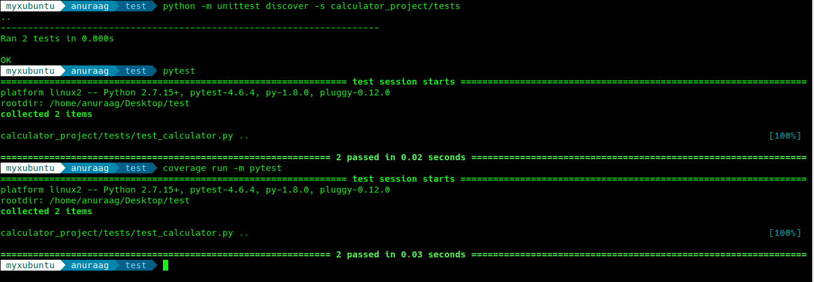

# Testing With Python - Calendar Application

This is a simple calculator application, showing how to use `unittest`, `pytest` and `coverage` packages of python.

> Note: Rename the repository to `calculator_project` for it to work

# Commands

> To be run in a directory 1 level above the current repository, `ls` command should show `calculator_app` folder

- `python -m unittest discover -s calculator_project/tests`

- `pytest`

- `coverage run -m pytest`

# Requirements

- `unittest`
> Generally available by default

- `pytest` can be installed using `pip install pytest`

- `coverage` can be installed using `pip install coverage`
